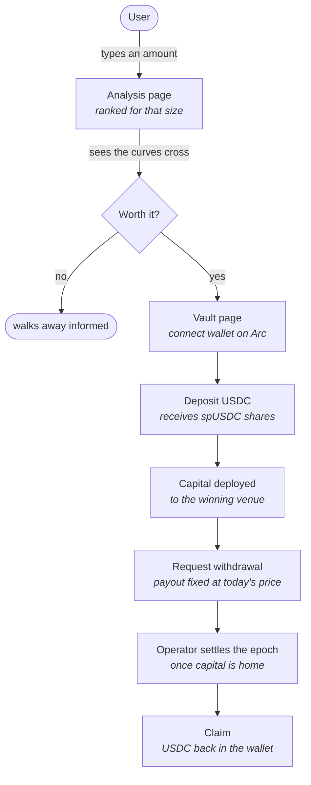
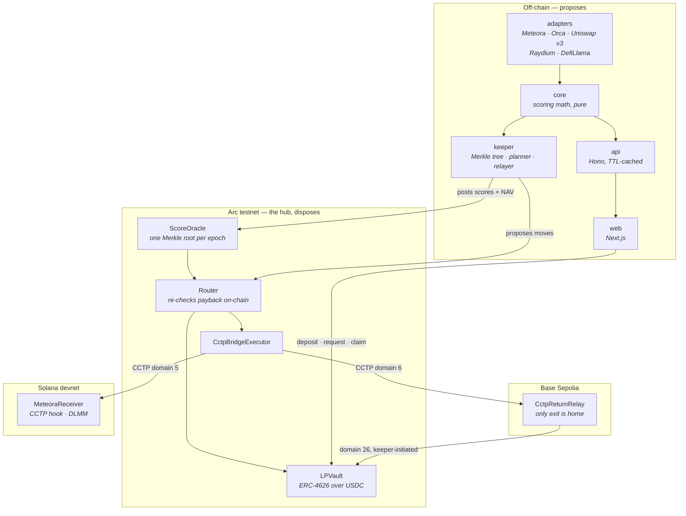

# Spidey — honest LP yield, priced for your deposit, routed across chains

*A USDC LP vault built on Arc. What it fixes, how a user moves through it, and
which parts of Arc's infrastructure carry the weight.*

---

## 1. The problem

Every yield dashboard prints one number per pool. That number is a lie of
omission, twice over.

### It counts money that is not earning

A concentrated-liquidity pool only pays fees on liquidity sitting at the
current price. Everything parked outside that band earns nothing — but it is
still in the TVL the advertised rate was divided by.

That is not a rounding error. From one live capture:

| Pool | Displayed TVL | Actually in range | Share |
|---|---:|---:|---:|
| SOL/USDC (Orca) | $25.5M | $115k | **0.45%** |
| USDC/USDT (Orca) | $1.18M | $638k | 53.9% |
| WETH/USDC (Uniswap v3, Base) | $112M | $8.76M | 7.81% |

The first row divides by **222× more money than is working**. Two pools, the
same asset class, the same minute — and a headline rate cannot tell them apart.

### It assumes you are not in it yet

Your deposit joins that same denominator. Put $10,000 into a pool with $115k
genuinely in range and you have just diluted the pool you are measuring. Put in
$1M and there is barely a rate left.

```
your rate  =  365 × fee rate × in-range volume
              ─────────────────────────────────
               in-range liquidity  +  your deposit
```

Only the denominator contains *your deposit*. So:

> **The best pool is a function of how much you deposit — and no dashboard asks
> you for that number.**

### The second-order problem: moving costs money

Once you can rank honestly, the obvious move is to chase the top of the list.
That is how a vault bleeds. Every switch costs gas, slippage and a bridge fee,
and a rate advantage that takes 24 days to repay its own cost is not an
advantage over a 7-day hold.

So the real problem is two problems: **measure honestly**, then **refuse to act
on small edges**.

---

## 2. What Spidey does

- Measures in-range liquidity per venue, and **excludes any pool it cannot
  measure** rather than approximating it.
- Re-prices every pool for the deposit size you type in.
- Shows what happens as that size grows — the curves cross, so the best pool
  changes with your amount.
- Routes real capital into the winner, but only when an **on-chain** check
  agrees the gain repays the cost of moving.

The governing rule, which shapes everything downstream:

> If a venue cannot supply in-range liquidity, it is **excluded from ranking,
> not approximated.** An approximated denominator reintroduces the exact bug the
> product exists to remove.

Adapters return `null` when they cannot measure. Unrankable pools appear in
their own table *with a reason*. Nothing is quietly filled in.

---

## 3. The user's path through it



Two things about this flow are deliberate and unusual.

**Withdrawals are asynchronous, and the contract says so.** `withdraw()` and
`redeem()` revert outright. Capital sitting in a position on Solana cannot be
returned in the same Arc transaction, and a vault that pretends otherwise is a
vault that breaks under its first real exit. Request → settle → claim is honest
about the wait.

**Every action is simulated before the wallet is asked to sign.** A refusal
arrives as a sentence — "the mark is too old to pay against", "cap $100,000,
held $99,995 — room for $5.00" — instead of a hex revert after you have already
spent gas.

---

## 4. Architecture



**Off-chain proposes; on-chain disposes.** The scoring engine can be wrong, slow
or captured and still cannot move user funds. The Router re-checks the payback
inequality in integer arithmetic and declines if it does not hold:

```
SWITCH  iff   365 · cost · 10000 · κ_num  ≤  hold_days · κ_den · amount · Δbps
```

Cross-multiplied rather than divided, so nothing truncates — at $50,000 the true
payback is 0.49 days, which an integer division would floor to zero and wave
through.

**No off-chain party holds a key that can move user funds.** The reporter posts
scores and NAV. The keeper proposes. Only the Router moves capital.

### Hub and spoke, with a deliberate asymmetry

Arc is the hub and holds no venue of its own. Capital leaves in one transaction;
**every return must be initiated on the far chain.** Nothing on Arc can reach
into a Solana position and pull it back. Rather than hide that, the contracts
state it: `CctpBridgeExecutor.exit()` reverts by design, and a `FLAG_PENDING_HOOK`
bit marks capital that is burned here and not yet minted there — claimable in
neither place.

---

## 5. Arc infrastructure, and how we use it

### USDC as the native gas token

Arc is the unusual case where the asset and the gas are the same thing. USDC is
the native currency at **18 decimals**, and the ERC-20 at
`0x3600000000000000000000000000000000000000` is a **shim over that same balance
at 6 decimals**.

- **Verified live, not assumed.** The deployer reads `18180797` through the
  ERC-20 and `18180797561624000000` wei natively — the same balance, exactly
  `1e12` apart.
- **A depositor never needs a second token.** Gas and principal come out of one
  pot. Our live deposit of 0.1 USDC cost **$0.002658** in gas, paid in the
  asset being deposited.
- **It forced a real accounting decision.** A `balanceOf` through the shim costs
  **~11,162 gas against ~2,100** for a conventional ERC-20 — measured on-chain.
  Because `totalAssets()` sits on the deposit, withdrawal-request and NAV paths,
  that surcharge lands almost everywhere. So `LPVault` **tracks idle balance in
  storage** instead of reading the token.
- **That optimisation closed a security hole for free.** A tracked balance means
  a direct transfer into the vault cannot move the share price, which kills the
  donation/inflation vector outright. `unaccountedBalance()` and `syncIdle()`
  exist to recover such funds deliberately, under an explicit owner action.
- **Three decimal scales meet in the UI** — USDC 6, spUSDC shares 9 (ERC-4626
  adds a 3-place virtual-share offset), native gas 18. Each is labelled on
  screen and each is unit-tested, because mixing them is the easiest way to put
  a number a million times wrong in front of a user.

### CCTP v2 — native burn-and-mint

- `TokenMessengerV2` at `0x8FE6B999Dc680CcFDD5Bf7EB0974218be2542DAA` — the
  **same address on Arc and Base**, established by reading it off the two live
  contracts rather than copied from a table.
- **Arc's CCTP domain is 26**, confirmed against Circle's live attestation API
  rather than documentation: a burn originating on Arc reports source domain 26.
- `CctpBridgeExecutor.enter()` calls `depositForBurn` toward domain 6 (Base) or
  domain 5 (Solana). Real USDC, burned and reminted — not a wrapped
  representation with its own bridge risk.
- **`destinationCaller` is left empty on purpose.** Anyone may relay the
  attestation. Circle's relayer cannot alter a message, only decline to submit
  one, so pinning a caller adds a liveness dependency and buys no safety.
- **A fee cap below the transfer amount is enforced on-chain.** A `maxFee` at or
  above the amount would let the entire transfer be eaten by fees and still read
  as a successful deployment.

### Circle App Kit + the attestation API

- `@circle-fin/app-kit` with `BridgeChain.Arc_Testnet`, `Base_Sepolia` and
  `Solana_Devnet` — one bridge abstraction across an EVM hub and a Solana spoke.
- **Per-chain adapters, resolved at call time.** `adapterFor(chain)` replaced a
  single `wallet.adapter`, because an EVM adapter cannot sign a Solana
  transaction and App Kit will accept the wrong one without a type error —
  failing later, possibly *after* a burn.
- **Proven end to end.** 0.4 USDC burned on Solana devnet and minted on Arc,
  unattended, first attempt. The mint's recipient was `MessageTransmitterV2`,
  so it was a genuine `receiveMessage` against Circle's attestation rather than
  a transfer dressed up as one.

### Arc's EVM: Cancun, and Multicall3

- **EIP-1153 transient storage is live** (chain 5042002, reth v1.11.3). We
  probed it with `eth_call` before depending on it — `PUSH1 42; TSTORE; TLOAD`
  returns `0x2a` — then used `TSTORE`/`TLOAD` for the reentrancy guard at
  **100 gas against ~5,000** for the storage-slot pattern. MCOPY and
  BLOBBASEFEE also execute.
- **Multicall3 is deployed** at the canonical `0xcA11bde…76CA11`. Verified with
  `eth_getCode`, not assumed. The vault page reads a dozen slots per refresh in
  **one round trip** against a public RPC.
- **`block.timestamp` from the chain, never the browser clock.** Every staleness
  rule in the vault is judged against chain time, so the UI reads it from the
  latest block — a machine with a wrong timezone would otherwise report a stale
  mark on a healthy vault.

### Arc's blocklist precompile — a constraint worth naming

USDC transfers on Arc consult a compliance precompile that Foundry's simulator
does not implement. Fork tests and `forge script` runs that move USDC therefore
revert locally while the identical call succeeds on-chain.

- We **broadcast state-changing USDC operations with `cast send`**, and reserve
  `forge script` for deploy-and-wire steps that move no tokens.
- The live deposit runner drives the *real* code path — the UI's own predicate
  and `simulateContract` — and delegates only the signature, so the keystore is
  never decrypted into the process.

### Arcscan

- Every transaction hash and contract address in the vault UI links to
  `testnet.arcscan.app`. A user who does not believe a number can go and read
  the receipt.

---

## 6. The design system

**We did not use an Arc or Circle brand kit.** No Arc logos, wordmarks or
palette appear anywhere in the product. Worth stating plainly rather than
leaving ambiguous.

What the interface uses instead:

- **Its own palette**, "Forest Stake" — one green hue carries the brand, with
  amber reserved for warnings so that gap direction and dilution never depend on
  green alone. Both light and dark themes are real and user-toggleable, and
  every pair is WCAG-verified by computed relative luminance rather than by eye.
- **Inter and JetBrains Mono** — one sans for every label and sentence, mono
  reserved for tabular figures so numbers align column-wise and stay comparable.
- **A separate, validated chart palette.** The brand green cannot separate four
  venues for a colour-blind reader, so the dilution chart uses categorical
  slots from a data-viz reference palette, machine-validated against both real
  card surfaces: worst adjacent CVD ΔE 9.1 light, 8.4 dark. Two light-mode
  slots fall below 3:1 contrast, which is answered with mandatory direct labels
  and a table view rather than ignored.
- **`prefers-reduced-motion` is honoured everywhere.** Motion is also
  load-bearing rather than decorative: the dash travelling the Arc → Base or
  Arc → Solana path animates only while that venue actually carries
  `FLAG_PENDING_HOOK`. If the line moves, capital is genuinely in flight.
- **The spider-web mark** is the project's own, blended in-browser so a single
  white-on-black asset reads correctly on both themes.

---

## 7. What is proven, and what is not

Being specific about this is part of the point.

**Proven on-chain:**

- The full custody cycle on Arc — deposit, request, settle, claim.
- A real deposit through the UI's own code path: `approve` + `deposit`,
  0.1 USDC, shares minted exactly matching the simulation, gas $0.002658.
- Arc → Base Sepolia over CCTP v2, and Solana devnet → Arc, both round-tripped.
- Uniswap v3 on Base Sepolia: a live position opened and 99.702 of 100 USDC
  round-tripped.
- A Meteora DLMM position opened and unwound on Solana devnet.

**Not yet proven:**

- No Arc → Solana accounting round trip has completed. The CCTP path works; the
  vault-side booking for a domain-5 arrival has not been exercised end to end.
- `reportNav` runs but has never posted against a non-zero mark on the live hub.
- The contracts are the current bytecode in the repo but are **not yet
  source-verified** on the explorer.

**Known limitation, stated rather than hidden:** inside the NAV freshness
window, an unmarked loss is still paid out at par. Nothing on-chain can
distinguish a venue that lost money from one that did not until somebody says
so. What the bound removes is the *indefinite* version, where a mark nobody
refreshes keeps the vault looking solvent forever.

---

*Arc testnet, chain 5042002. Test funds only.*
